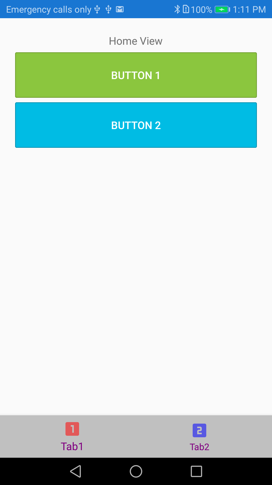

# Xamarin Forms using MVVMCross framework to render a bottom Tab Bar

Xamarin Forms 3.6 supports the rendering of a TabBar in Android natively at the bottom.

This project takes it one step further to see if MvvmCross's support for the TabbarPage works in this mode.

## Screenshot

### Android

# Aside: Build Times in AppCenter

|Flags|Build Time|Binary Size|Startup Time|
|-----|----------|-----------|------------|
|Embed Assemblies in native Code|1 min 56 sec|15.2MB|3.8 sec|
|AOT + LLVM|3 min 1 sec|26.8MB|2.65 sec|
|Embed Assemblies + AOT + LVVM|2 min 47 sec|18.7MB|2.25 sec|
